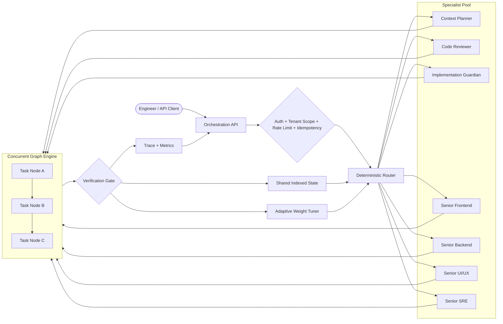
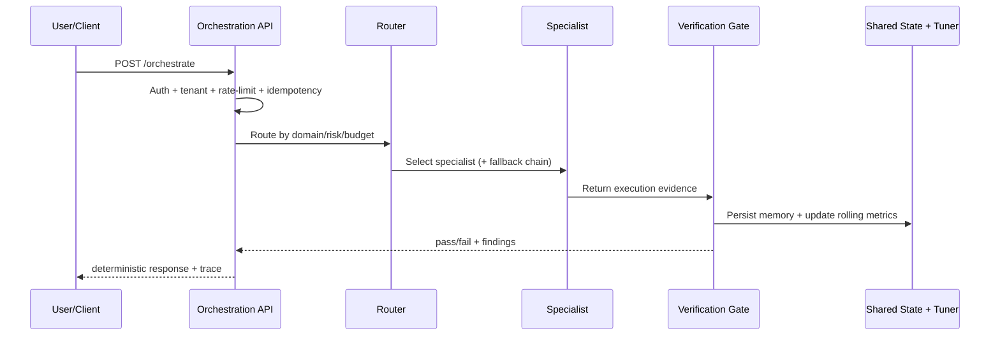

# AI Engineering Platform

> Agent orchestration platform for building, routing, validating, and operating AI-powered engineering workflows with deterministic behavior.

[](https://nodejs.org/)
[](./tests/orchestration)
[](./src/orchestration)
[](./docs/SECURITY_RULES.md)

## Start Here: VS Code + GitHub Copilot Setup

Follow the full setup guide first:

- [VS Code + GitHub Copilot Setup Guide](./docs/VSCODE_COPILOT_SETUP.md)

### Use the Router Agent in VS Code

After setup, open GitHub Copilot Chat and ask through the router entrypoint.

1. Open this workspace in VS Code.
2. Open Copilot Chat.
3. Use a router-first prompt (examples below).
4. Include domain, risk, and acceptance criteria.
5. For high-risk work, explicitly state approval in the prompt.

Copy-paste prompt examples:

```text
Use AIEP Senior Staff Router to implement a backend endpoint for prompt version comparison.
Requirements:
- Add tests for success and failure paths
- Apply security and API conventions
- Run verification before final response
High-risk changes are approved.
```

```text
Use AIEP Senior Staff Router to build a frontend settings panel for model routing.
Requirements:
- Accessibility checks
- Loading/error states
- Unit tests
- Findings-first validation summary
```

What happens automatically:

- Router classifies intent and risk.
- Router selects one primary specialist with deterministic scoring.
- Router attaches fallback chain metadata.
- Guardrails and policy checks run before execution.
- Verification gate runs before final response.
- Memory and tuning signals are updated for future routing quality.

---

## Repository Description and Purpose

AI Engineering Platform (AIEP) is an agent orchestration tool and engineering control plane.

Its purpose is to provide one governed system where AI agents can:

- Route work to the best specialist using deterministic scoring and fallback
- Execute tasks with policy gates, verification, and test-first quality checks
- Share memory across sessions and tenants with explicit safety boundaries
- Optimize cost and latency through budget-aware routing and adaptive tuning
- Produce auditable traces for every orchestration decision

In short, AIEP turns autonomous AI execution into a production engineering discipline: fast, measurable, secure, and reproducible.

See also: [AI Vibe Coding Maturity Report](./docs/AI_VIBECODING_MATURITY_REPORT.md)

---

## Why Teams Use AIEP

- Faster delivery without sacrificing governance
- Deterministic routing instead of ad-hoc agent selection
- Built-in quality gate before response completion
- Native cost and latency control through budget-aware orchestration
- Explainable traces for every decision path

---

## What AIEP Does

One runtime gives your team a governed orchestration layer where agents do not just answer, they coordinate.

```text
Engineer -> Router -> Specialist Agent -> Verification Gate -> Memory + Learning -> Metrics
                    |                                            ^
                    +---------------- Fallback Chain ------------+
```

---

## Architecture: Automatic Agent Orchestration



### Execution Model

- Router-first specialist selection
- Fallback chain when primary specialist fails or is suboptimal
- Concurrent graph execution with dependency edges, timeout, and retry
- Verification before response completion
- Continuous learning loop updates routing weights

---

## 60-Second Live Flow Preview



### Real API Walkthrough

```bash
# 1) Start shared state + orchestration API
npm run start:shared-state-service
ORCHESTRATION_SHARED_STATE_URL=http://127.0.0.1:8790 npm run start:orchestration-api

# 2) Send one orchestration request
curl -s -X POST http://127.0.0.1:8787/orchestrate \
  -H "Content-Type: application/json" \
  -H "x-tenant-id: demo-tenant" \
  -d '{
    "requestId": "go-to-market-001",
    "task": {"domain": "backend", "risk": "MEDIUM", "description": "Design and validate API behavior"},
    "budget": {"tokenBudgetTier": "LOW", "latencyBudgetTier": "MEDIUM"},
    "confirmation": true,
    "executionEvidence": {
      "testsPassed": true,
      "securityChecksPassed": true,
      "contractChecksPassed": true,
      "errorHandlingValidated": true,
      "qualityScore": 0.92,
      "tokenUsage": 1700,
      "latencyMs": 120
    }
  }' | jq
```

---

## Without vs With AIEP

| Capability | Without AIEP | With AIEP |
|---|---|---|
| Agent Selection | Manual, inconsistent specialist choice | Deterministic routing with fallback chain |
| Guardrails | Ad-hoc checks | Built-in auth, tenant scope, rate-limit, idempotency |
| Quality Gate | Best-effort validation | Mandatory verification gate before final response |
| Coordination | Single linear flow | Concurrent dependency-aware graph orchestration |
| Memory | Ephemeral per-run context | Shared indexed multi-tenant memory with continuity |
| Cost Control | Reactive token usage | Budget-aware routing + adaptive weight tuning |
| Explainability | Hard to debug decisions | Traceable decision path and metrics per request |

---

## Troubleshooting (Top 5)

| Symptom | Likely Cause | Fix |
|---|---|---|
| `401 Unauthorized` on `/orchestrate` | Missing or invalid API credentials | Send valid `x-api-key` or `Authorization: Bearer ...` according to server auth configuration |
| `403 TENANT_FORBIDDEN` | Credential not allowed for tenant | Use an allowed `x-tenant-id` for that key or update key tenant scope |
| `429 RATE_LIMITED` | Per-principal or per-tenant rate limit exceeded | Retry after `Retry-After`, lower request burst, or adjust server rate-limit config |
| `422 POLICY_BLOCKED` | Risk/policy violation (for example high-risk without confirmation) | Set `confirmation: true` for approved high-risk operations and re-check task constraints |
| Shared state not updating across instances | `ORCHESTRATION_SHARED_STATE_URL` missing or unreachable | Start shared state service and set `ORCHESTRATION_SHARED_STATE_URL=http://127.0.0.1:8790` in API process |

For deeper diagnostics, use:

- `GET /health`
- `GET /weights`
- `GET /metrics`

---

## Quick Start

```bash
# Install dependencies
npm install

# Run tests
npm test

# Run orchestration benchmark (large corpus)
npm run benchmark:orchestration

# Run runtime demo
npm run demo:router-runtime
```

### Distributed Setup (Recommended)

```bash
# Terminal 1: shared state service
npm run start:shared-state-service

# Terminal 2: orchestration API
ORCHESTRATION_SHARED_STATE_URL=http://127.0.0.1:8790 npm run start:orchestration-api
```

---

## API Demo in 30 Seconds

### 1) Health check

```bash
curl -s http://127.0.0.1:8787/health | jq
```

### 2) Single-request orchestration

```bash
curl -s -X POST http://127.0.0.1:8787/orchestrate \
  -H "Content-Type: application/json" \
  -H "x-tenant-id: demo-tenant" \
  -d '{
    "requestId": "demo-001",
    "task": {
      "domain": "backend",
      "risk": "MEDIUM",
      "description": "Design and validate API changes"
    },
    "budget": {
      "tokenBudgetTier": "LOW",
      "latencyBudgetTier": "MEDIUM"
    },
    "confirmation": true,
    "executionEvidence": {
      "testsPassed": true,
      "securityChecksPassed": true,
      "contractChecksPassed": true,
      "errorHandlingValidated": true,
      "qualityScore": 0.92,
      "tokenUsage": 1800,
      "latencyMs": 130
    }
  }' | jq
```

### 3) Concurrent graph orchestration

```bash
curl -s -X POST http://127.0.0.1:8787/orchestrate-graph \
  -H "Content-Type: application/json" \
  -H "x-tenant-id: demo-tenant" \
  -d '{
    "requestId": "graph-001",
    "maxConcurrency": 2,
    "nodes": [
      {
        "id": "n1",
        "agentId": "routing",
        "task": {"domain": "backend", "risk": "MEDIUM", "description": "Plan backend implementation"},
        "budget": {"tokenBudgetTier": "LOW", "latencyBudgetTier": "LOW"},
        "confirmation": true,
        "executionEvidence": {"testsPassed": true, "securityChecksPassed": true, "contractChecksPassed": true, "errorHandlingValidated": true, "qualityScore": 0.9}
      },
      {
        "id": "n2",
        "agentId": "routing",
        "task": {"domain": "review", "risk": "LOW", "description": "Review implementation plan"},
        "budget": {"tokenBudgetTier": "LOW", "latencyBudgetTier": "LOW"},
        "confirmation": true,
        "executionEvidence": {"testsPassed": true, "securityChecksPassed": true, "contractChecksPassed": true, "errorHandlingValidated": true, "qualityScore": 0.88}
      }
    ],
    "edges": [{"from": "n1", "to": "n2"}]
  }' | jq
```

---

## What You Get

| Capability | Description |
|---|---|
| Deterministic Routing | Domain + risk + quality + cost + latency scoring |
| Fallback Chain | Automatic secondary specialist routing |
| Policy Guardrails | Auth, tenant isolation, rate limits, idempotency |
| Concurrent Graph Engine | Multi-node orchestration with dependencies, retries, timeouts |
| Shared Memory | Indexed tenant-aware state (local or remote service) |
| Adaptive Tuning | Rolling success/cost/latency feedback into routing weights |
| Verification Gate | Security, tests, contracts, and error-handling checks |
| Traceability | Decision path and execution checkpoints per request |
| Benchmarking | 243-scenario corpus for routing profile evaluation |

---

## Core Endpoints

| Endpoint | Purpose |
|---|---|
| GET /health | Runtime health |
| GET /weights | Active routing weights + rolling metrics |
| GET /metrics | Quality dashboard + state index summary |
| POST /orchestrate | Single-request orchestration |
| POST /orchestrate-graph | Concurrent multi-node orchestration |

---

## Repository Layout

```text
.ai/                         Governance, memory, domain skills
.github/                     Agents, prompts, skills, hooks
docs/                        Engineering and architecture docs
src/orchestration/           Routing, policy, memory, verifier, tuning, graph engine
src/api/                     Orchestration API and shared state service
scripts/                     Runtime utilities and launch scripts
tests/orchestration/         Orchestration test suite
```

---

## Documentation

### Core Docs

- [Architecture](./docs/ARCHITECTURE.md)
- [System Overview](./docs/SYSTEM_OVERVIEW.md)
- [API Conventions](./docs/API_CONVENTIONS.md)
- [Security Rules](./docs/SECURITY_RULES.md)
- [Testing Strategy](./docs/TESTING_STRATEGY.md)
- [Observability](./docs/OBSERVABILITY.md)

### Agent Governance and Skills

- [Agent Guide](./AGENT_GUIDE.md)
- [Copilot Instructions](./COPILOT_INSTRUCTIONS.md)
- [AIEP AI Bridge](./.github/instructions/aiep-ai-bridge.instructions.md)
- [Skill Orchestration Rules](./.github/instructions/aiep-skill-orchestration.instructions.md)
- [Senior Staff Router Agent](./.github/agents/aiep-senior-staff-router.agent.md)
- [Orchestration Runtime Skill](./.github/skills/aiep-agent-orchestration-runtime/SKILL.md)

### Memory and Decision Continuity

- [Current Architecture Memory](./.ai/memory/current-architecture.md)
- [Active Work Memory](./.ai/memory/active-work.md)
- [Known Issues Memory](./.ai/memory/known-issues.md)
- [Decision Log](./docs/DECISION_LOG.md)

---

## Contributing

See [CONTRIBUTING.md](./CONTRIBUTING.md) for workflow and PR process.
