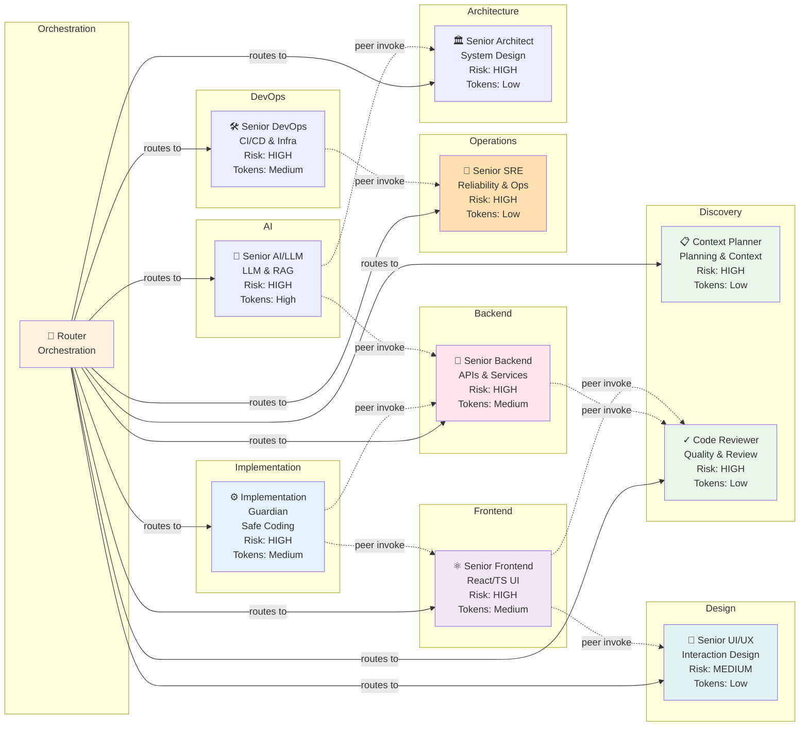
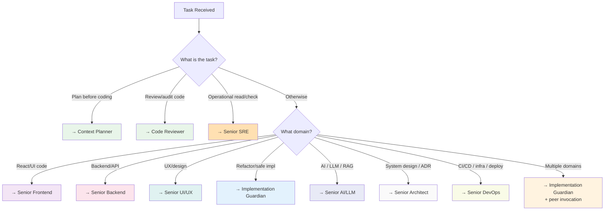

# Agent Capability Matrix

Detailed capability mapping showing all 11 routing-system agents (Router + 10 specialists), their domains, risk ceilings, token tier fitness, and peer collaboration patterns.

## Full Capability Table

| Agent | Domain | Primary Role | Risk Ceiling | Token Tier Fit | Peer Collaboration | Notes |
|---|---|---|---|---|---|---|
| **Router** | Orchestration | Deterministic routing | — | Any | N/A (coordinator) | Selects 1 specialist; provides fallback chain |
| **Context Planner** | planning, strategy, decomposition | Pre-execution analysis | HIGH | Low | Can be invoked by any primary specialist | Mandatory context loading sequence |
| **Code Reviewer** | review, security, testing, code-quality | Review-first execution | HIGH | Low | Invoked by Implementation Guardian, Frontend, Backend for quality gates | Pre-PR readiness, security checks |
| **Implementation Guardian** | implementation, security, refactor, code-quality | Refactoring & safe coding | HIGH | Medium | Can invoke Backend, Frontend, Code Reviewer | Architecture constraint checking; test coverage mandatory |
| **Senior Backend** | backend, api, data, auth, database, migration | Backend implementation | HIGH | Medium | Can invoke Code Reviewer, SRE; invokable by Implementation Guardian | API contracts, domain logic, data handling |
| **Senior Frontend** | frontend, ui, accessibility, component, state-management | Frontend implementation | HIGH | Medium | Can invoke UI/UX, Code Reviewer; invokable by Implementation Guardian | Component design, state, accessibility, performance |
| **Senior UI/UX** | ux, ui, frontend, accessibility, design-system | UX quality | MEDIUM | Low | Invokable by Frontend, Implementation Guardian | User journeys, accessibility UX, design systems |
| **Senior SRE** | sre, reliability, observability, performance, monitoring | Operational excellence | HIGH | Low | Invokable by Implementation Guardian for observability patterns | Incident readiness, SLI/SLO, release safety |
| **Senior AI/LLM** | ai, llm, ml, inference, embeddings, rag | LLM / AI engineering | HIGH | High | Can invoke Backend for API integration, Architect for model design | Prompt engineering, RAG pipelines, model evaluation, inference optimization |
| **Senior Architect** | architecture, design, api, strategy | System design & ADRs | HIGH | Low | Consulted by any specialist for design decisions | System boundaries, ADR authoring, API contract design, scalability |
| **Senior DevOps** | devops, infrastructure, deployment, cicd, containers | Infrastructure & CI/CD | HIGH | Medium | Can invoke SRE for observability; invokable by Backend/Frontend for deploy | CI/CD pipelines, containerisation, IaC, release management |

## Routing Decision Tree

## Peer Invocation Patterns

**Allowed (single-hop invocation only):**
- Implementation Guardian → Senior Backend (API contract clarification)
- Implementation Guardian → Senior Frontend (component integration)
- Senior Frontend → Senior UI/UX (accessibility/interaction)
- Senior Backend → Code Reviewer (quality gate)
- Senior Frontend → Code Reviewer (quality gate)
- Senior AI/LLM → Senior Backend (API integration for model endpoints)
- Senior AI/LLM → Senior Architect (model design and system boundary decisions)
- Senior DevOps → Senior SRE (observability and reliability validation)
- Any specialist → Context Planner (context reload)

**Not allowed:**
- Chains (A → B → C)
- Circular dependencies (A → B → A)
- Multiple peers (A → B and A → C simultaneously)
- SRE → Implementation changes (use Implementation Guardian for file edits)

## Token Budget Allocation by Risk Level

| Risk Level | Recommended Token Tier | Suitable Specialists |
|---|---|---|
| LOW | Any (optimize for speed) | Context Planner, Code Reviewer, UI/UX, Architect, SRE |
| LOW–MEDIUM | Low–Medium | Code Reviewer, UI/UX, (any low-risk domain) |
| MEDIUM | Medium | Backend, Frontend, Implementation Guardian, DevOps |
| MEDIUM–HIGH | Medium–High | Backend, Frontend, SRE, Implementation Guardian, DevOps, AI/LLM |
| HIGH–CRITICAL | High (explicit confirmation) | AI/LLM, Implementation Guardian + peer if needed |

---

**See:** [AGENT_ORCHESTRATION.md](AGENT_ORCHESTRATION.md) for routing rules and fallback chains.
