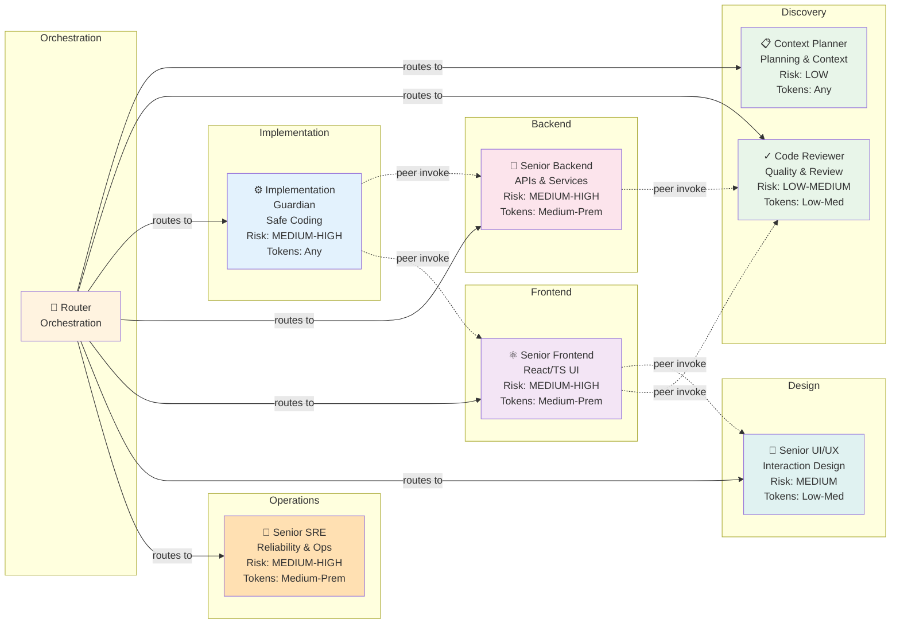
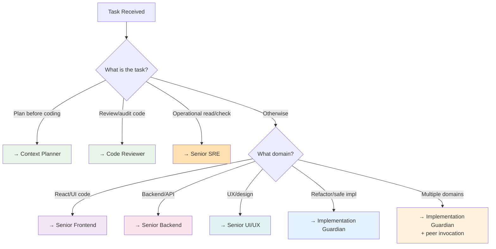

# Agent Capability Matrix

Detailed capability mapping showing all 8 routing-system agents (Router + 7 specialists), their domains, risk ceilings, token tier fitness, and peer collaboration patterns.

## Full Capability Table

| Agent | Domain | Primary Role | Risk Ceiling | Token Tier Fit | Peer Collaboration | Notes |
|---|---|---|---|---|---|---|
| **Router** | Orchestration | Deterministic routing | LOW–HIGH | Any | N/A (coordinator) | Selects 1 specialist; provides fallback chain |
| **Context Planner** | Planning & Discovery | Pre-execution analysis | LOW | Any | Can be invoked by any primary specialist | Mandatory context loading sequence |
| **Code Reviewer** | Quality & Validation | Review-first execution | LOW–MEDIUM | Low–Medium | Invoked by Implementation Guardian, Frontend, Backend for quality gates | Pre-PR readiness, security checks |
| **Implementation Guardian** | Safe Implementation | Refactoring & coding | MEDIUM–HIGH | Any | Can invoke Backend, Frontend, Code Reviewer | Architecture constraint checking; test coverage mandatory |
| **Senior Backend** | APIs & Services | Backend implementation | MEDIUM–HIGH | Medium–Premium | Can invoke Code Reviewer, SRE; invokable by Implementation Guardian | API contracts, domain logic, data handling |
| **Senior Frontend** | React/TS UI | Frontend implementation | MEDIUM–HIGH | Medium–Premium | Can invoke UI/UX, Code Reviewer; invokable by Implementation Guardian | Component design, state, accessibility, performance |
| **Senior UI/UX** | Interaction Design | UX quality | MEDIUM | Low–Medium | Invokable by Frontend, Implementation Guardian | User journeys, accessibility UX, design systems |
| **Senior SRE** | Reliability & Ops | Operational excellence | MEDIUM–HIGH | Medium–Premium | Invokable by Implementation Guardian for observability patterns | Incident readiness, SLI/SLO, release safety; read-only for audits |

## Routing Decision Tree

## Peer Invocation Patterns

**Allowed (single-hop invocation only):**
- Implementation Guardian → Senior Backend (API contract clarification)
- Implementation Guardian → Senior Frontend (component integration)
- Senior Frontend → Senior UI/UX (accessibility/interaction)
- Senior Backend → Code Reviewer (quality gate)
- Senior Frontend → Code Reviewer (quality gate)
- Any specialist → Context Planner (context reload)

**Not allowed:**
- Chains (A → B → C)
- Circular dependencies (A → B → A)
- Multiple peers (A → B and A → C simultaneously)
- SRE → Implementation changes (use Implementation Guardian for file edits)

## Token Budget Allocation by Risk Level

| Risk Level | Recommended Token Tier | Suitable Specialists |
|---|---|---|
| LOW | Any (optimize for speed) | Context Planner, Code Reviewer, UI/UX |
| LOW–MEDIUM | Low–Medium | Code Reviewer, UI/UX, (any low-risk domain) |
| MEDIUM | Medium | Backend, Frontend, Implementation Guardian |
| MEDIUM–HIGH | Medium–Premium | Backend, Frontend, SRE, Implementation Guardian |
| HIGH–CRITICAL | Premium (explicit confirmation) | Implementation Guardian + peer if needed |

---

**See:** [AGENT_ORCHESTRATION.md](AGENT_ORCHESTRATION.md) for routing rules and fallback chains.
