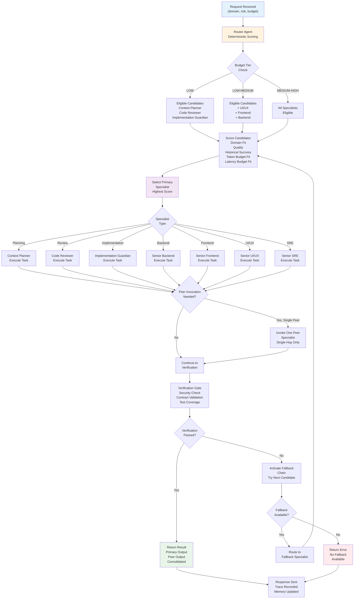

# Agent Orchestration Routing Flow

Visual representation of how AIEP routes incoming requests to specialist agents.

## Flow Legend

| Step | Description |
|---|---|
| **Request Received** | Domain, risk level, token budget tier, latency budget |
| **Router Scoring** | Deterministic multi-factor scoring across eligible candidates |
| **Budget Tier Check** | Filter candidates by token and latency budget fit |
| **Score & Select** | Deterministic scoring: domain-fit → quality → history → budget → latency |
| **Execute Primary** | Selected specialist executes (may invoke one peer if needed) |
| **Peer Invocation** | If cross-domain blocker: invoke exactly one peer specialist (single-hop) |
| **Verification Gate** | Security, contract, test coverage validation before response |
| **Fallback Chain** | If verification fails, activate pre-computed fallback specialist |
| **Return Result** | Consolidated output from primary (+ peer if invoked) |

## Routing Rules Summary

1. **Context Planner selected when:** Planning-first, risk-scoping, or context-loading strategy needed before coding
2. **Code Reviewer selected when:** Review-first (bugs, regressions, risks, missing tests)
3. **Frontend selected when:** React/TypeScript UI, state, rendering, accessibility
4. **Backend selected when:** API contracts, domain logic, data handling, services
5. **UI/UX selected when:** User journeys, interaction quality, information hierarchy
6. **SRE selected when:** Reliability, incident response, observability, SLI/SLO, release safety
7. **Implementation Guardian selected when:** Safe coding, refactoring, or operational SRE work requiring file edits
8. **Exactly one primary specialist** selected per request
9. **Peer invocation single-hop only:** Primary may invoke ONE peer if cross-domain blocker (no chains)
10. **Fallback chain provided** when more than one candidate is eligible
11. **Confidence check:** If < 70%, ask one clarifying question before routing
12. **Verification gate mandatory** before returning response

## Specialist Risk Ceilings

| Specialist | Risk Ceiling | Token Tiers |
|---|---|---|
| Context Planner | LOW | Any |
| Code Reviewer | LOW–MEDIUM | Low–Medium |
| Implementation Guardian | MEDIUM–HIGH | Any |
| Senior Backend | MEDIUM–HIGH | Medium–Premium |
| Senior Frontend | MEDIUM–HIGH | Medium–Premium |
| Senior UI/UX | MEDIUM | Low–Medium |
| Senior SRE | MEDIUM–HIGH | Medium–Premium |
| Router | LOW–HIGH (meta) | Any |

---

**See:** [AGENT_ORCHESTRATION.md](AGENT_ORCHESTRATION.md) for detailed capability matrix and collaboration rules.
