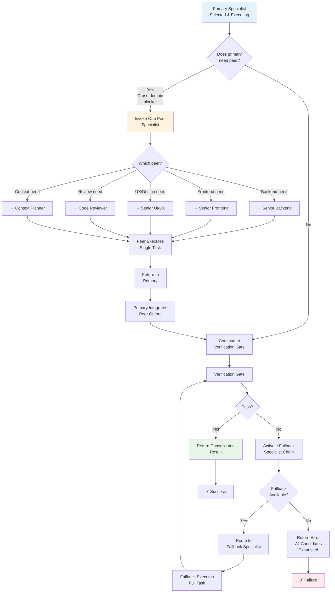

# Specialist Fallback & Collaboration Chain

Reference guide for automatic fallback routing and peer specialist invocation patterns.



## Fallback Chain by Specialist Type

### Context Planner (PRIMARY)
```
PRIMARY: Context Planner
├─ FALLBACK 1: Router re-route to Code Reviewer (if risk > LOW)
└─ FALLBACK 2: Router re-route to Implementation Guardian (if implementation needed)
```

### Code Reviewer (PRIMARY)
```
PRIMARY: Code Reviewer
├─ FALLBACK 1: Implementation Guardian (if implementation changes needed)
└─ FALLBACK 2: Router re-route to domain specialist (Backend/Frontend/SRE)
```

### Implementation Guardian (PRIMARY)
```
PRIMARY: Implementation Guardian
├─ CAN INVOKE: Senior Backend, Senior Frontend, Code Reviewer (peer, single-hop)
├─ FALLBACK 1: Code Reviewer (if quality gate fails)
└─ FALLBACK 2: Domain specialist (Backend/Frontend) based on domain fit
```

### Senior Backend (PRIMARY)
```
PRIMARY: Senior Backend
├─ CAN INVOKE: Code Reviewer, Senior SRE (peer, single-hop)
├─ FALLBACK 1: Code Reviewer (if quality issues)
└─ FALLBACK 2: Implementation Guardian (if refactoring required)
```

### Senior Frontend (PRIMARY)
```
PRIMARY: Senior Frontend
├─ CAN INVOKE: Senior UI/UX, Code Reviewer (peer, single-hop)
├─ FALLBACK 1: Senior UI/UX (if UX/interaction issues)
└─ FALLBACK 2: Code Reviewer (if quality issues)
```

### Senior UI/UX (PRIMARY)
```
PRIMARY: Senior UI/UX
├─ CAN INVOKE: None (design is terminal)
├─ FALLBACK 1: Senior Frontend (if implementation needed)
└─ FALLBACK 2: Implementation Guardian (if cross-cutting changes)
```

### Senior SRE (PRIMARY)
```
PRIMARY: Senior SRE
├─ CAN INVOKE: None directly (read/execute only)
├─ FALLBACK 1: Implementation Guardian (if file edits needed)
└─ FALLBACK 2: Code Reviewer (if incident response validation needed)
```

### Router (ORCHESTRATOR)
```
PRIMARY: Router (selects one specialist)
├─ FALLBACK 1: Pre-computed 2nd-place specialist
├─ FALLBACK 2: Pre-computed 3rd-place specialist
└─ ERROR: All candidates fail after 2 fallbacks
```

## Peer Invocation Examples

### Example 1: Implementation Guardian → Senior Backend

**Scenario:** Implementing a React component that calls a new backend API.

```
1. Router selects: Implementation Guardian (highest score)
2. Implementation Guardian starts: "I'll build the component"
3. Issue: "New API contract needed"
4. Invokes peer: Senior Backend
5. Senior Backend: Returns API spec + contract
6. Implementation Guardian: Integrates API spec, builds component
7. Verification gate: Contract validation passes
8. Response: Consolidated implementation + API contract
```

**Rationale:** Cross-domain dependency (Frontend + Backend API contract).

### Example 2: Senior Frontend → Senior UI/UX

**Scenario:** Building an interactive dashboard with complex state and UX patterns.

```
1. Router selects: Senior Frontend (React/state focus)
2. Senior Frontend starts: "I'll build the component"
3. Issue: "UX pattern guidance needed for complex transitions"
4. Invokes peer: Senior UI/UX
5. Senior UI/UX: Returns interaction design spec
6. Senior Frontend: Integrates UX patterns, implements state
7. Verification gate: Accessibility validation passes
8. Response: Consolidated component + UX integration notes
```

**Rationale:** Interaction design expertise (Frontend + UX).

### Example 3: Senior Backend → Code Reviewer (Quality Gate)

**Scenario:** Implementing a critical API endpoint with security implications.

```
1. Router selects: Senior Backend
2. Senior Backend: Implements endpoint + tests
3. Verification gate: Quality check needed
4. Invokes peer: Code Reviewer
5. Code Reviewer: Security audit, test coverage check
6. Senior Backend: Integrates feedback
7. Response: Endpoint + audit findings + remediation
```

**Rationale:** Security verification (Backend + Code Reviewer).

## Collaboration Rules (Enforced)

| Rule | Details |
|---|---|
| **Single Primary** | Exactly one primary specialist per request; no parallel primaries |
| **Single Peer** | Primary may invoke AT MOST one peer specialist |
| **Single-Hop Only** | Peer cannot invoke another peer (no chains A → B → C) |
| **No Circularity** | A→B and B→A not allowed |
| **Primary Owns Output** | Primary responsible for final integration and consolidated response |
| **Fallback Chain** | Pre-computed at routing time; activated only on verification failure |
| **Context Preservation** | Peer receives full context from primary; no context loss |

## When Fallback Chain Activates

Fallback chain activates when:

1. **Verification Gate Fails** — Security check, contract validation, or test coverage issues
2. **No Peer Available** — Peer invocation impossible (e.g., already at depth limit)
3. **Primary Capacity Exceeded** — Task complexity beyond primary's risk ceiling
4. **Confidence Drop** — Multiple issues reduce confidence below threshold

Fallback does NOT activate when:

- Task completes successfully with or without peer
- Peer invocation succeeds
- Verification gate passes

## Token Budget Impact

| Scenario | Token Cost | Notes |
|---|---|---|
| Primary only (no peer) | Low–Medium | Most efficient; used when domain is clear |
| Primary + 1 peer | Medium–High | Cross-domain work; unavoidable for complex tasks |
| Fallback activated | High–Premium | Re-execution; indicates initial routing suboptimal |
| Multiple fallbacks | Premium+ | Rare; indicates high uncertainty or edge case |

---

**See:** [AGENT_ORCHESTRATION.md](AGENT_ORCHESTRATION.md) for routing rules and capability matrix.
